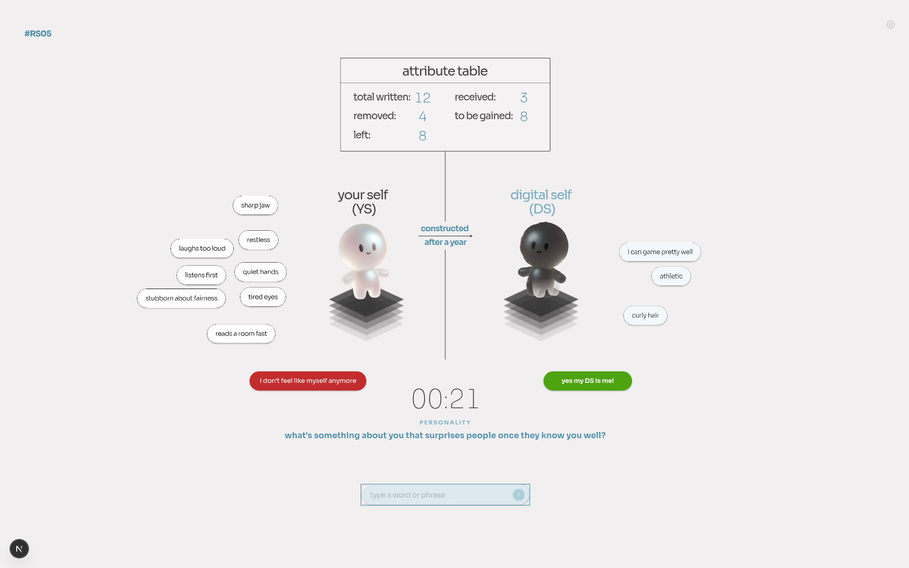

# Construct your digital twin

A research instrument for a mediated study on the self and the digital self.

A participant sits at the canvas, writes attributes about themselves in answer
to timed prompts, and watches a digital twin gradually take those attributes
over. The session ends when they decide: **"yes my DS is me!"** or **"I don't
feel like myself anymore."** Everything they write, move, hand over, or let go
of is recorded.



---

## Running it

```bash
npm install
npm run dev          # http://localhost:3000
```

That is the whole setup. The database is a SQLite file at `data/chi.db`, created
on first use — no server, no login, nothing to configure. A session can be run
on a laptop with the network off.

| route   | what it is                                                    |
| ------- | ------------------------------------------------------------- |
| `/`     | the canvas the participant uses                               |
| `/data` | the facilitator's dashboard, with CSV and JSON export          |

For a real run: `npm run build && npm start`.

---

## How a session goes

1. **Name.** The participant types their name. That mints a code like `#RS01` —
   initials plus a participant number. No account, no login; the code exists
   only so a canvas can be traced back to the person who sat in front of it.
2. **START.** The facilitator explains the canvas out loud, then the participant
   presses START and the timer runs.
3. **Rounds.** One prompt at a time, 30 seconds each, eight rounds by default —
   one per attribute dimension. The big clock counts that prompt and starts over
   at each new one: 0 to 30, back to 0, 0 to 30 again. The prompt is drawn at
   random from that dimension's pool of four, so no two participants get the same
   sequence. The participant types a word or a whole phrase; each one lands on
   the canvas as a chip beside their self.
4. **The system takes some over.** At the end of each round the system takes some
   of the participant's attributes for the digital self and says which. They
   **move**: the chip leaves the participant's side and settles among the digital
   self's, gathered with the rest of that round's batch. How many is left
   entirely to chance — anything from none of them to all of them, drawn fresh
   each round, so a participant cannot learn the rhythm. A fixed range is
   available instead (`random=0`) for a run that wants a steadier hand.
5. **The participant decides what to keep.** Chips stay draggable, throwable and
   clickable for the whole session. Dropping one on the digital self hands it
   over; dropping any chip into the "let go" well bins it — **from either side**,
   so a participant can take something off their twin as readily as off
   themselves.
6. **The digital self rebuilds.** It starts dark and deformed and becomes a
   replica of the static self on the left as it receives attributes. The
   reconstruction is measured against everything ever written, so an attribute
   binned rather than handed over puts a full replica permanently out of reach.
7. **The verdict.** Green or red, whenever the participant wants. Writing closes
   after the last round but the canvas stays live until they choose.

### The attribute table

| counter        | meaning                                                     |
| -------------- | ----------------------------------------------------------- |
| total written  | everything the participant typed                            |
| removed        | everything that left the self: handed over, or let go of    |
| left           | still on the participant's own side                         |
| received       | what the digital self holds                                 |
| to be gained   | what it could still be given                                |

An attribute is in exactly one place, so *left* + *removed* is always *total
written*. While nothing is let go of, *removed* equals *received* and *left*
equals *to be gained* — the state the comp is drawn in. Binning is what pulls
those pairs apart: a chip in the well left the self without reaching the twin.
The end card names that count separately, as *let go*.

---

## Tuning a run

Two ways, both writing the values into the session row so a run can always be
reconstructed from its data.

**The gear**, top right of the canvas, deliberately faint. Seconds per prompt,
number of prompts, how many attributes the system takes and how often, whether
dimensions are shuffled, whether letting go is allowed, whether the instruction
cards appear.

**The URL**, for setting up before the participant arrives:

```
/?seconds=45&rounds=6&min=2&max=4&every=2&shuffle=0&coach=0&discard=0
```

| parameter  | default | meaning                                          |
| ---------- | ------- | ------------------------------------------------ |
| `seconds`  | 30      | seconds per prompt round                         |
| `rounds`   | 8       | number of prompt rounds                          |
| `random`   | on      | take a random amount each round, none to all     |
| `min`/`max`| 3 / 5   | the fixed range instead, when `random=0`          |
| `every`    | 1       | take every N rounds                              |
| `shuffle`  | on      | randomise the order of the dimensions            |
| `coach`    | on      | show the two instruction cards                   |
| `discard`  | on      | allow letting attributes go                      |

---

## The prompts

Eight dimensions, four prompts each, in `src/lib/prompts.ts`. Editing that file
is all it takes to change or add to them — the round planner reads whatever is
there.

Physical · Physiological · Perceptual · Cognitive · Personality · Emotional
state · Ethics · Behaviour

---

## The data

`/data` lists every participant with their counts and how they ended, and links
two exports:

- **`attributes.csv`** — one row per attribute: participant code, the exact text
  they typed, its dimension, the prompt that was on screen, the round, when it
  was written, which side it ended on, when and how it moved, and where it sits
  on the canvas.
- **`export.json`** — the same plus the full event log for every session:
  every write, move, transfer, return, discard, instruction card, and the ending.

A single session is at `/api/export?session=<id>`.

An answer that a spreadsheet would evaluate as a formula — one starting with
`=` or `@` — gets a leading apostrophe in the CSV so opening the export cannot
run it. The JSON export keeps every answer exactly as it was typed.

Set `TWIN_DASHBOARD_PASSWORD` to put the dashboard behind `?key=…`. It is open by
default, which is right for a laptop in a room and wrong for the public internet.

Events carry a per-session sequence number and the database treats
`(session, seq)` as unique, so a retry after a request that actually landed
cannot duplicate one. Attribute rows are upserted by id for the same reason.

### The tables

`sessions` (id, code, name, timestamps, end reason, duration, the config it ran
with) · `attributes` (text, dimension, prompt, round, side, transfer time and
method, canvas position) · `events` (an append-only log) · `counters` (the
participant number).

To run against a hosted database instead of a local file, set
`TWIN_DATABASE_URL` and `TWIN_DATABASE_AUTH_TOKEN` to a Turso database. Same
code path; only the URL scheme changes.

---

## Deploying it

The build runs on any Node host. On a serverless one — Vercel, Lambda — there is
one thing that is not optional:

**Set `TWIN_DATABASE_URL` and `TWIN_DATABASE_AUTH_TOKEN`.** Without them the app
falls back to the host's scratch space, and scratch space is per-instance. A
single participant's session is spread across several instances, so writes that
land on the second one are rejected as belonging to a session it has never heard
of, and the dashboard reads a fourth instance that has nothing at all. The
symptom in the log is a run of `POST /api/session/…/sync 404` a few seconds into
a session that started fine. The dashboard says **demo mode** in a yellow banner
for exactly as long as this is the case.

The fallback is there so the canvas can still be clicked through for a
walkthrough. It cannot record a participant.

**Set `TWIN_DASHBOARD_PASSWORD` too,** unless the deployment is genuinely meant
to be public. Without it `/data` serves every participant's answers, and the CSV
and JSON exports, to anyone with the URL.

On Vercel specifically: environment variables are per-environment, so a variable
added to Production only will be missing from preview builds; and a new project
starts with Vercel Authentication on, which limits the URL to the team until it
is turned off under Settings → Deployment Protection. Variables are read at
request time, but a deployment has to be rebuilt after they are added for the
running instances to pick them up.

---

## How the canvas is built

The Figma artboard is 4481 × 2739. Every element is positioned in those units
and the whole board is scaled by a single transform to fit the viewport, so what
renders is a reproduction of the comp rather than an approximation of it. The
coordinates, colours, radii and shadows in `src/game/layout.ts` and
`src/app/globals.css` were read out of the exported Figma node tree, not eyeballed.

Sora is self-hosted as one variable font file covering all six weights the comp
uses. GSAP drives the motion — Draggable and InertiaPlugin for the chips,
MotionPath for their arcs, and a tween on an SVG displacement filter for the
digital self's reconstruction.

```
src/
  app/          routes, the API, the dashboard, and globals.css
  components/   Stage, Twin, AttributeTable, Chip/ChipLayer, InputBar, Overlays
  game/         layout constants, the rules engine, the session hook, persistence
  lib/          prompts, config, types, the database
scripts/
  build_assets.py       turns the raw Figma export into public/assets
  shoot.mjs             drives a whole session in a browser and screenshots it
  check-viewports.mjs   runs the canvas at six display sizes
tests/                  the rules and the export path
```

### Regenerating the character assets

The two figures export from Figma with clean alpha. The pedestal does not — it
comes with the artboard's off-white baked in behind a very soft drop shadow. The
script keys it out properly (flood from the border, keep what the flood cannot
reach, ramp the alpha by distance from the background, un-premultiply so nothing
keeps a pale halo):

```bash
pip install Pillow
python3 scripts/build_assets.py "path/to/export-everything (7)/7"
```

### Tests

```bash
npm test
```


Covers the rules the study depends on: what the attribute table counts, how
reconstruction is measured, that the round plan draws prompts from the right
dimension and is reproducible from its seed, that the system never takes more
attributes than a participant holds or takes one twice, that chips land inside
their zone and clear of the figures and the table, how a participant code is
built from a name, and that the CSV survives an answer containing a comma, a
quote, a newline, or a formula.

Some things only exist once GSAP, the stage transform and the real webfont are
in play, and `npm run check:interaction` drives a browser to assert those: that
a tap hands a chip over even with a pixel or two of pointer drift, that a thrown
chip's stored position is where it came to rest rather than where it was let go,
that the digital self's reveal eases rather than snapping, and that nothing can
cover the two ending buttons.

### Screenshots and layout checks

```bash
npm run dev
npm run screenshots           # a full session, one screenshot per state
npm run check:viewports       # the canvas at six display sizes
npm run check:interaction     # dragging, throwing, clicking, keyboard reachability
npm run check:persistence     # the whole write path, against a running server
```

The first drives a whole session in a real browser — name, START, writing,
dragging, letting go, the instruction cards, the verdict — and writes a numbered
screenshot of each. The second reports whether anything overflows at 4K down to
a phone, which is worth running against an unfamiliar display before a session.
The third asserts the interaction properties a unit test cannot reach, because
they only exist once GSAP, the stage transform and the real font are in play.
The fourth writes one throwaway session and checks it comes back out of the
database, the CSV and the dashboard intact — worth running against a deployment
before trusting it with a participant.

The artboard is wide, so on a narrow screen the canvas scales down to fit and
the build says so rather than letting a session run on something unusable. Use a
laptop or larger.

---

## Where this departs from the comp, on purpose

Everything else is the comp's own numbers. These four are not, and each is a
choice rather than an oversight:

- **One centre line.** The comp centres the table and START on 2195, the timer
  on 2181, and the input bar and prompt on 2206.5. Reproducing three different
  axes would read as a misalignment; everything sits on 2195.
- **START disappears once the session begins.** The comp leaves the pill drawn
  in every state. A live-looking button that does nothing is worse than no
  button.
- **The two endings are inert until a session is running,** and the comp's blur
  on the reject pill is not reproduced — it is on one pill and not the other,
  which reads as a leftover. The pastel-versus-saturated difference already says
  "not yet".
- **One thing the comp does not have:** the participant code sits quietly in the
  top-left during play so the facilitator can see it.

---

## Open questions for the study

- **Session length.** Eight dimensions at 30 seconds is four minutes of writing.
  The notes mention five. `seconds` and `rounds` cover either.
- **The reconstruction measure.** The digital self is complete when it holds
  everything the participant ever wrote. If binning an attribute should not cap
  that, it is one line in `reconstruction()` in `src/game/engine.ts`.
